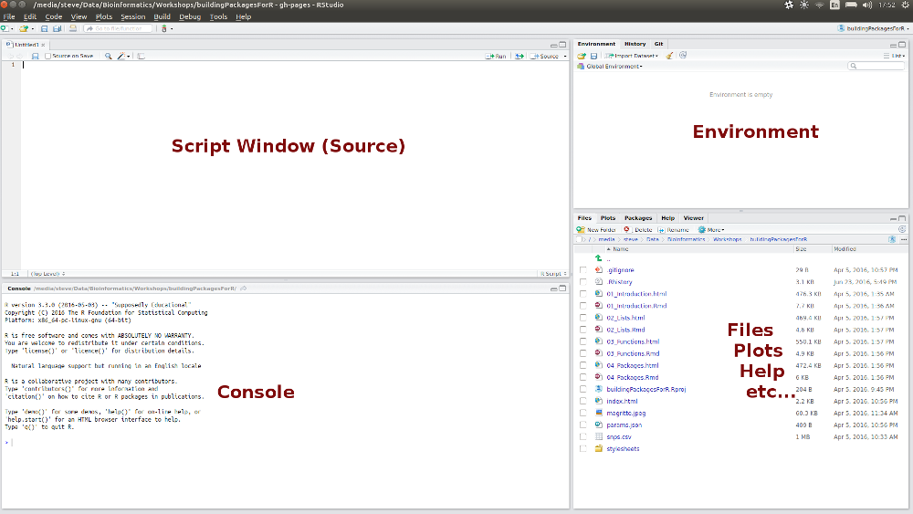
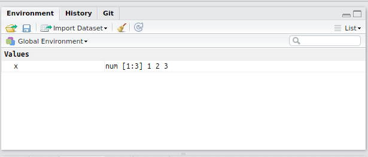

To return to the previous page click [here](https://uofabioinformaticshub.github.io/schoolOfMedicine2016/) or use the back button on your browser.

## Why use R?

- R offers numerous advantages over Excel, GraphPad Prism & the like
- Is the main software used for analysis of biological data (along with Python)

### Designed for real data

- Can handle extremely large datasets  
- We can easily perform complex analytic procedures
- Many processes come as inbuilt functions  
- Huge user base of biological researchers

### Automatic Conversion

Excel is notorious for converting values from one type to another inappropriately.

- Gene names are often converted to dates 
    - Septin genes (e.g. _SEPT9_)
    - "Deleted in Esophigeal Cancer 1" (_DEC1_)

- Genotypes can be converted into numeric values
    - A homozygote for the first allele (1/1)
    
### Reproducible Research

- Research is littered with mistakes from Excel
- Studies have made Phase III trials
- _We have code to record and repeat our analysis_
- We can track errors more easily than if they are copy/paste errors

## Using R

>"With power comes great responsibility" - Uncle Ben
  
With this extra capability, we need to understand a little about:  

- Data Types  
- Data Structures  

We will also briefly touch on:  

- Reading data into R
- Visualising Data

-----

## RStudio

1. Open `RStudio` then
2. `File` > `New File` > `R Script`  
3. Save As `RTutorial.R`



## The Script Window

- This is just a text editor.
- We enter our commands here but they are not executed
- Commands are sent to the `Console` by selecting a line/section, then either
    - `Ctrl + Enter`
    - Copy & Paste into the Console
    - Clicking the `Run` button at the top right of the `Script Window`
    
__Let's create an R object called `x`__

1. Enter the following in the `Script Window`, then send it to the `Console`

*NB: R is case-sensitive so please be careful*

```{r}
x <- 5
```

We can see the contents of the object `x` by just entering it's name in the `Console` (or in the `Script Window` & sending it to the `Console`)

```{r}
x
```


## The R Environment

In the R Environment, we can create objects of multiple types.
We first give them a name (e.g. `x`) and then assign a value to it using the `<-`symbol.
_This is like an arrow putting the value into the object._

*R* objects are only visible when we enter the object name in the `Console`.

The R Environment is like a desk (or Workspace) where we can leave things out of view until we need them.
In RStudio, the `Environment` tab in the top right shows what's currently in our Environment.
This is the list of objects we can perform operations (or analyses) on.  


Nothing is saved to disk, until we save the complete Environment as an `.RData` object.
We can do this by clicking the disk symbol in the Environment Tab, or by entering the code:

```{r, eval=FALSE}
save.image()
```

By default, *R* will save the workspace as a file named `.RData` and this will contain all of the *R* objects you currently have in your environment.

-----

## Data Types

**What is the difference between these two?**

- 7
- "7"  

The first represents the *value* 7, whilst the second is the *character* that we use to represent this in text.
To your computer these mean different things!

Excel will automatically try to convert "7" to the value 7, but automatic conversion can be troublesome.
In R we maintain control over this delineation.

## The Basic Data Types
The basic (or atomic) data types in R are:

1. `logical` (`TRUE` or `FALSE`)
2. `integer` (e.g. the value `5` that we gave to x)
3. `double` (also known as `numeric`)
4. `character`

**When would you need an integer rather than a double?**

- For count data
- For indexing rows or columns in a `matrix`
- For incrementing through a process in steps

**Some examples of logical tests/values**

```{r}
x > 0
x == 5
x < 0
```

[Back](https://uofabioinformaticshub.github.io/schoolOfMedicine2016/)