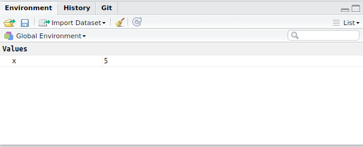

## Why use R?
R offers numerous advantages over Excel, GraphPad Prism & the like:  

### Designed for real data

- Can handle extremely large datasets  
- We can easily perform complex analytic procedures
- Many processes come as inbuilt functions  
- Huge user base of biological researchers

### Automatic Conversion

Excel is notorious for converting values from one type to another inappropriately.

- Gene names are often converted to dates 
    - Septin genes (e.g. _SEPT9_)
    - "Deleted in Esophigeal Cancer 1" (_DEC1_)

- Genotypes can be converted into numeric values
    - A homozygote for the first allele (1/1)
    
### Reproducible Research

- Research is littered with mistakes from Excel
- Studies have made Phase III trials
- _We have code to record and repeat our analysis_
- We can track errors more easily than if they are copy/paste errors

## Using R

>"With power comes great responsibility" - Uncle Ben
  
With this extra capability, we need to understand a little about:  

- Data Types  
- Data Structures  

We will also briefly touch on:  

- Reading data into R
- Visualising Data


## RStudio

This is the main way we interact with R


## The R Environment
In the R Environment, we can create objects of multiple types.
We first give them a name (e.g. `x`) and then assign a value to it using the `<-`symbol.
This is like an arrow putting the value into the object.
*R* objects are only visible when we enter the object name in the _Console_.
```{r}
x <- 5
x
```

It's like a desk (or Workspace) where we can leave things out of view until we need them.
In RStudio, the _Environment_ tab in the top right shows what's currently in our Environment.  


Nothing is saved to disk, until we save the complete Environment as an _.RData_ object.
We can do this by clicking the disk symbol in the Environment Tab, or by entering the code:
```{r, eval=FALSE}
save.image()
```
By default, *R* will save the workspace as a file named `.RData` and this will contain all of the *R* objects you currently have in your environment.


## Data Types

**What is the difference between these two?**

- 7
- "7"  

The first represents the value 7, whilst the second is the character that we use to represent this in text.
To your computer these mean different things!

Excel will automatically try to convert "7" to the value 7, but automatic conversion can be troublesome.

__What happens when you enter the gene names for SEPT9, DEC1, FEB2 etc. into Excel?__

__What about if you have genotypes coded as `0/1`, `1/1`, `1/2` etc__

In R we maintain control over this delineation.

## The Basic Data Types
The basic (or atomic) data types in R are:

logical (TRUE or FALSE)
```{r}
x == 5
```

integer
```{r}
sampleSize <- 6
```

double (also known as "numeric")
```{r}
meanLifeSpan <- 2.05
```

character
```{r}
species <- "mouse"
```

**When would you need an integer rather than a double?**

- For count data
- For indexing rows or columns in a `matrix`
- For incrementing through a process in steps

## Vectors
R sees everything as a _vector_
These are like columns in a spreadsheet, where we have entries in multiple cells.
Importantly, _every entry must be of the same data type_!
```{r}
lifeSpans <- c(2.1, 1.9, 1.7, 1.8, 2.3, 2.5)
lifeSpans
```
This is a _numeric_ vector, where all entries are double precision entries (i.e. they have decimal points).  
**What would happen if we accidentally included the letter "a" in this vector?**

- *R* would convert all the numbers to characters, and we would have to convert them back to numbers before proceeding any further.


We can perform simple operations on a vector by using some in-built functions.
Functions in R, consist of their name, followed by the round braces `()`.
We then pass an *R* object to the function, by including it inside these braces.
```{r}
mean(lifeSpans)
```

**Try some other functions**  
Some examples may be sd(), var(), max(), min(), median(), summary()

**Could we apply these functions to integer vectors?**  
**What about character vectors?**

Try some if you'd like.
```{r}
int_vec <- 1:5
sd(int_vec)
char_vec<- c("cats", "internet")
min(char_vec)
```
Try the different functions and see what results they give you.
You might see confusing error messages, but remember **error messages are your friend**.
They tell you something isn't right, and (sometimes) give you a clue as to what is wrong, even though they can be frustrating.

In the above, we just printed the results to the screen.
Sometimes we may want to save the results as a new *R* object.
For example, every vector also has a length attribute, which is just the number of entries in the vector, and this can be how we find out our sample size.
```{r}
sampleSize <- length(lifeSpans)
sampleSize
```

## Subsetting Vectors
We can extract single values, or sets of values, from a vector by using square brackets
```{r}
lifeSpans[1]
lifeSpans[4:6]
```


## Factors
One other data type we see in R is a _factor_.
*R* will sometimes assume that any character strings represent categorical variables.
```{r}
Groups <- c("treated", "control", "control", "control", "treated", "treated")
Groups <- factor(Groups)
Groups
```

These can be a trap for the unwary, as behind the scenes *R* has saved these as integers, corresponding to which category (_or factor level_) the values belong to.
```{r}
as.integer(Groups)
```
In one sense, these are like a hybrid of an integer vector, where the values represent the category number, and a character vector which contains the various category names.
In the old days of puny computers, this was more memory efficient.
It also makes sense when you consider statistical modelling is at the heart of R.

## Data Frames
One of the most common data structures in *R* is a `data.frame`.
These are very similar to a spreadsheet in Excel, and we have columns with information in them.
*Each column must be the same length!*
```{r}
mouseLife <- data.frame(lifeSpans, Groups)
mouseLife
```

Note how R automatically named the columns.
We could also specify these manually.
 
```{r}
mouseLife <- data.frame(lifeSpans, Groups,
                        sex  = c("M", "M", "M", "F", "F", "F"))
mouseLife
```

We can easily subset a `data.frame` based on values in a column.

```{r}
subset(mouseLife, sex =="M")
```

We can also call a column individually, using the `$` symbol followed by the column name.

```{r}
mouseLife$Groups
```

